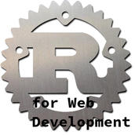

# Rust for Web Development

This simple book is meant be a something like quick start guide for starter to develop web application using Rust. This book assumes that readers should have basic understanding of programming in Rust and also how to use Cargo for project management. That said, this book will not teach you about everything that have been discussed in [The Rust Programming Language](https://doc.rust-lang.org/book/).

[Read the book](contents.md).

# Author(s)

This book is written by members of [Web Intelligence Research Group](https://github.com/wi-rg) at [STMIK AKAKOM Yogyakarta](http://www.akakom.ac.id):

* [Bambang Purnomosidi D. P.](http://bpdp.xyz): primary author, editor, maintainer, all hands person.

# Contribute

We are gladly accept pull request and any other contributions. If you want to contribute contents, have a look at [how to contribute - unfortunately still in Bahasa Indonesia](https://github.com/wi-rg/articles/tree/master/kontribusi-repo)

# Using This Book

You may build this book using these commands:

* `make`: Build book in 3 formats (EPUB, HTML, dan PDF), results will be in `BUILD` directory (see [Makefile](Makefile)).
* `make pdf` to build PDF, `make html` to biild HTML, and finally `make epub` to build EPUB.

# License

[CC-BY-SA 4.0](http://creativecommons.org/licenses/by-sa/4.0/)

# /etc

This book is developed using markdown and can be converted to EPUB - HTML - PDF using [pandoc](http://pandoc.org). Template for this book was stolen from [evangoer/pandoc-ebook-template](https://github.com/evangoer/pandoc-ebook-template).
